# 旧サイト生 CSV（input/raw/）ER図

> 作成日: 2026-07-14
> 目的: `input/raw/` 配下の各 CSV ファイルをエンティティ、CSV 内の項目をカラムとして図示し、ファイル間のリレーションを明確化する。
> 結合キーの根拠: [`docs/csv-interface/join-keys.md`](../csv-interface/join-keys.md)、[`作業方針設計書.md`](./作業方針設計書.md) §5.1

## 対象ファイル

`input/raw/` 配下の 11 CSV ファイルすべてを対象とする。

| CSV ファイル | エンティティ名（図中） | 役割 |
| --- | --- | --- |
| `User.csv` | User | 会員マスタ |
| `UserAccount.csv` | UserAccount | 会員アカウント |
| `UserAddress.csv` | UserAddress | 会員と住所の紐付け |
| `PointBankAccount.csv` | PointBankAccount | ポイント残高 |
| `Address.csv` | Address | 住所（配送先・請求先） |
| `OrderCustomer.csv` | OrderCustomer | 注文者情報 |
| `PurchaseOrder.csv` | PurchaseOrder | 注文ヘッダ |
| `PurchaseOrderService.csv` | PurchaseOrderService | 注文の付帯サービス情報（Code/Value） |
| `DeliveryOrder.csv` | DeliveryOrder | 配送情報 |
| `OrderLine.csv` | OrderLine | 注文明細 |
| `Products.csv` | Products | 商品マスタ（3 行ヘッダの英語項目名を採用） |

> `Products.csv` は「日本語項目名 / 型定義 / 英語項目名」の 3 行ヘッダ構成のため、図中カラム名は 3 行目の英語項目名（`Id`, `ExternalId1` 等）を採用し、括弧内に日本語項目名を付記する。

---

## ER図（Mermaid）

> Mermaid 非対応の環境向けに、レンダリング済み画像 [`raw-csv-ER図.png`](./raw-csv-ER図.png) も同フォルダに配置している。

```mermaid
erDiagram
    User {
        string Id PK
        string SubscStoreCustomerId
        string LastName
        string FirstName
        string LastNameKana
        string FirstNameKana
        string ZipCode
        string Prefecture
        string City
        string Street
        string Building
        string IsApproveMailDelivery
        string Sex
        string Birthday
        string CreatedAt
        string UpdatedAt
        string DeletedAt
        string GmoMemberId
        string Email
        string EmailConfirmed
        string PhoneNumber
        string LockoutEnd
        string LockoutEnabled
        string AccessFailedCount
    }

    UserAccount {
        string UserNo PK
        string IsAnonymous
        string IsActive
        string UserName FK "User.Id と文字列一致"
        string CreateDate
        string ActivateDate
        string QuitDate
    }

    PointBankAccount {
        string UserNo PK, FK "UserAccount.UserNo"
        string BankCode
        string ExpireDate
        string ActivePoint
        string TemporaryPoint
        string CreateDate
    }

    UserAddress {
        string UserNo FK "UserAccount.UserNo"
        string AddressId FK "Address.addressId"
        string AddressName
    }

    Address {
        string addressId PK
        string recipientfirstname
        string recipientfirstnamekana
        string recipientlastname
        string recipientlastnamekana
        string countryCode
        string zipCode
        string pref
        string city
        string street
        string building
        string tel
    }

    OrderCustomer {
        string customerId PK
        string isGuest
        string UserNo FK "UserAccount.UserNo"
        string memberRank
        string memberStatus
        string ordererName
        string firstName
        string lastName
        string firstNameKana
        string lastNameKana
        string emailAddr
        string creditCardNumber
        string creditCardExpire
        string creditSecurity
        string artholizeNo
        string artholizeAt
        string creditResponseStatus
        string transactionNo
        string numberOfPayments
        string artholizeError
        string orderedAddressId FK "Address.addressId（購入者住所）"
        string invoiceAddressId "Address.addressId想定だが移行では未使用"
        string birthDay
        string sex
        string originalOrderId
        string PaymentDetail
        string paymentSlipNumber
        string paymentSlipUrl
        string completePayment
        string paymentMailAddr
        string guestAccessKey
        string autoCancelDate
    }

    PurchaseOrder {
        string orderId PK
        string orderType
        string orderStatus
        string orderDate
        string shipRequestDate
        string shipDate
        string deliveryCompleteDate
        string customerId FK "OrderCustomer.customerId"
        string paymentMethod
        string paymentStatus
        string taxRate
        string deliveryCharge
        string pointPaymentForDelivCharge
        string totalPayment
        string totalUsagePoint
        string returnPrice
        string cacheOnDeliveryCharge
        string cardPayment
        string totalAmount
        string cancelBeforeStatus
        string returnDate
        string extraPoint
        string extraPointSummary
        string siteId
        string memoId
        string bookingEnable
        string chargePointSummary
        string originalOrderId
        string estimateShipDate
        string allocationCompleteDate
        string deliveryReportDate
        string shipBookAt
        string deliveryBookAt
        string changeStamp
        string discountPrice
        string pointPaymentForPaymentCharge
    }

    PurchaseOrderService {
        string OrderId FK "PurchaseOrder.orderId"
        string Code
        string Value
    }

    DeliveryOrder {
        string orderId FK "PurchaseOrder.orderId（1注文1配送）"
        string deliveryDate
        string hourRange
        string wrappingType
        string senderName
        string addressName
        string deliveryNo
        string addressId FK "Address.addressId（受取人住所）"
        string shipSourceId
        string mailAddr
    }

    OrderLine {
        string orderLineId PK
        string orderLineType
        string orderId FK "PurchaseOrder.orderId"
        string reserveId
        string arriveNoticeId
        string productId FK "Products.Id"
        string parentId
        string orderAmount
        string allocateAmount
        string allocating
        string unitPrice
        string reportPrice
        string linePrice
        string tax
        string pointUsage
        string pointUsageTax
        string pointUsagePrice
        string pointCharge
        string pointChargeRate
        string allocateCompleteDate
        string extraPoint
        string memoId
        string productName
        string discountPrice
        string description
    }

    Products {
        string Id PK "内部商品ID"
        string ExternalId1 "外部ID1"
        string ExternalId2 "外部ID2"
        string ExternalId3 "外部ID3"
        string ExternalId4 "外部ID4"
        string Name "管理名"
        string SalesStatus "販売ステータス"
        string SalesStart "販売開始日時"
        string SalesEnd "販売終了日時"
        string Stockout "在庫0"
        string UnitPrice "単価"
        string SalesPatternId "販売パターンID"
    }

    User ||--o| UserAccount : "UserAccount.UserName = User.Id（文字列一致）"
    UserAccount ||--o| PointBankAccount : "UserNo"
    UserAccount ||--o{ UserAddress : "UserNo"
    UserAddress }o--|| Address : "AddressId"
    UserAccount ||--o{ OrderCustomer : "UserNo"
    OrderCustomer ||--o{ PurchaseOrder : "customerId"
    OrderCustomer }o--o| Address : "orderedAddressId（購入者住所）"
    PurchaseOrder ||--|| DeliveryOrder : "orderId（1:1）"
    DeliveryOrder }o--o| Address : "addressId（受取人住所）"
    PurchaseOrder ||--o{ PurchaseOrderService : "orderId"
    PurchaseOrder ||--o{ OrderLine : "orderId"
    OrderLine }o--|| Products : "productId = Id"
```

---

## リレーションの補足

| # | 関係 | 結合キー | 補足 |
| ---: | --- | --- | --- |
| 1 | User ← UserAccount | `UserAccount.UserName` = `User.Id`（文字列一致） | ID 体系が異なるため直接の FK ではなく値一致による論理結合。サンプルでは 61/100 件が突合 |
| 2 | UserAccount → PointBankAccount | `UserNo` | ポイント残高。未登録会員あり（85 件中 9 件不一致） |
| 3 | UserAccount → UserAddress → Address | `UserNo` → `AddressId` | 会員アドレス帳。サンプルでは `AddressId`↔`addressId` の ID 範囲が不一致（本番データで再検証予定） |
| 4 | UserAccount → OrderCustomer | `UserNo` | 注文者情報。ゲスト注文は `isGuest=1` |
| 5 | OrderCustomer → PurchaseOrder | `customerId` | 注文ヘッダ |
| 6 | OrderCustomer → Address（購入者住所） | `orderedAddressId` = `addressId` | `invoiceAddressId` は請求先想定だが移行では未使用（2026-07-09 確定） |
| 7 | PurchaseOrder ↔ DeliveryOrder | `orderId` | 1 注文 1 配送（分割配送なし）。サンプルで 100/100 件突合 |
| 8 | DeliveryOrder → Address（受取人住所） | `addressId` | 受取人住所・受取人メール(`mailAddr`)の結合キー |
| 9 | PurchaseOrder → PurchaseOrderService | `orderId`（`PurchaseOrderService.OrderId`） | 注文単位の付帯サービス（Code/Value 形式） |
| 10 | PurchaseOrder → OrderLine | `orderId` | 注文明細 |
| 11 | OrderLine → Products | `productId` = `Id`（内部商品ID） | 商品マスタ参照 |

### 移行対象外・留意事項

- `User.DeletedAt` に値があるレコードは削除済みアカウント → 会員・ポイント・アドレス帳・注文すべて移行対象外
- `UserAccount.IsAnonymous = 1`（ゲストアカウント）は会員 CSV 対象外、紐づく注文も対象外
- `UserAccount.UserName` が `User.Id` に存在しないレコードはゲストまたは退会済みとして会員 CSV 対象外

詳細な突合率・移行対象外条件は [`join-keys.md`](../csv-interface/join-keys.md) を参照。
